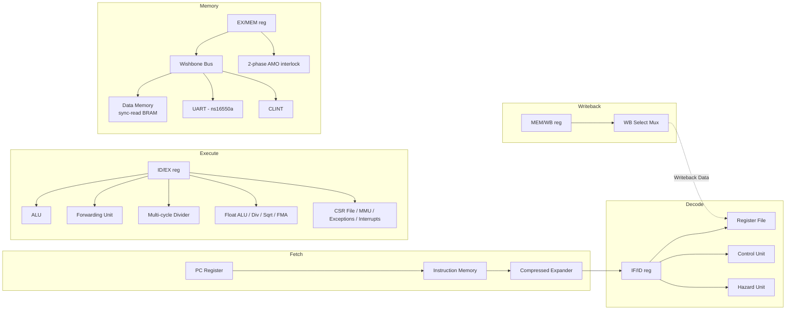

<div align="center">

# RV64IMAFDC RISC-V Core — In-Order Pipeline + Out-of-Order Core + Advanced ISA Extensions

**A synthesizable, hardware-verified RISC-V core project spanning two real microarchitectures: an
in-order 5-stage pipeline that boots real Linux kernel code, and a from-scratch out-of-order core
(register renaming, reservation stations, ROB, LSQ, Tomasulo scheduling, dual-issue) now extended with
ratified Bit-Manipulation, Vector, and Cryptography ISA extensions — all decoded through the same shared
control path, zero duplicated pipelines per extension.**


</div>

---

Every number in this README is read off real simulation output, not aspirational. The project's own
rule: nothing gets claimed as "done" until it's been run under a real simulator and, for anything that
touches RTL behavior, cross-checked against an independent reference simulator. `docs/adr/` has the
receipts — including every real bug this process has found and fixed, across 67 ADRs and six closed
generations of work.

## Contents

- [What this is](#what-this-is)
- [Generations](#generations)
- [The Linux boot attempt](#the-linux-boot-attempt)
- [Architecture — the in-order pipeline](#architecture--the-in-order-pipeline)
- [The out-of-order core (Generation 6)](#the-out-of-order-core-generation-6)
- [Advanced ISA extensions (Generation 7)](#advanced-isa-extensions-generation-7)
- [Privilege, MMU, and interrupts](#privilege-mmu-and-interrupts)
- [RV64F/D floating point](#rv64fd-floating-point)
- [SoC integration: bus, UART/CLINT, real interrupts](#soc-integration-bus-uartclint-real-interrupts)
- [Project status](#project-status)
- [Verification](#verification)
- [Research-platform toggles](#research-platform-toggles)
- [Toolchain & tooling](#toolchain--tooling)
- [Getting started](#getting-started)
- [Repository layout](#repository-layout)
- [Documentation](#documentation)

## What this is

Two real cores, sharing one repository, one ISA lineage, and one verification methodology:

- **`design/riscvpipeline.v`** — a classic 5-stage in-order pipeline
  (**Fetch → Decode → Execute → Memory → Writeback**) grown from a basic student pipeline into a core
  that boots into real, unmodified Linux kernel code. RV64IMAFD+C, the 'A' (atomic) extension, full M/S/U
  privilege with Sv32/Sv39 MMUs, real asynchronous interrupts, a hand-rolled SBI firmware, and a
  Linux-driver-compatible on-chip bus.
- **`design/OOOCore.v`** — a genuinely separate, from-scratch out-of-order core (register renaming,
  physical register file, reservation stations, reorder buffer, load/store queue, Tomasulo CDB
  scheduling, speculative branch/jalr execution, dual-issue) that **coexists** with the in-order pipeline
  rather than replacing it — `design/HeteroSoC.v` runs both simultaneously as a real heterogeneous
  dual-core SoC. Now extended with three ratified ISA extensions (Bit-Manipulation, Vector, Cryptography)
  reusing its existing scheduling/retirement machinery, not a bolted-on side pipeline per extension.

Shared foundations across both cores:

- **Verified against an independent instruction-set simulator** (`sim/tools/iss.py`), not just directed
  tests — including an interrupt-injection mode that fires real, unpredictably-timed interrupts
  mid-random-program and still requires bit-for-bit agreement. See [Verification](#verification).
- **Research-platform toggles at elaboration time, zero cost when unused**: swappable hazard strategy,
  pipeline depth, branch predictor, cache mode, and memory latency — each independently benchmarked.
- **FPGA-ready scaffolding**: parameterized memory sizes, a vendor-neutral top level, a debug
  observability port. Not yet validated on real hardware.

## The Linux boot attempt

Generation 3 (`docs/adr/0036`-`0039`) took a real, unmodified riscv64 Linux kernel `Image` (v5.5.0-rc7)
further than this project has ever run real-world binary code:

- A Verilator harness (bootstrapped from an existing OSS CAD Suite install) runs this core at ~1.4M
  cycles/sec — roughly 1000x faster than Icarus Verilog, the difference between a boot attempt that
  finishes in seconds and one that would take days.
- The kernel's own first instruction is a real compressed `c.j` — this core had zero RVC support at
  all. `design/CompressedExpander.v` implements the full standard quadrant table from scratch, verified
  against the real kernel's own compressed code (not a synthetic test).
- The kernel's own hart-bring-up check is a real `amoadd.w` — this core had zero 'A'-extension support
  at all. A new, independent 2-phase MEM-stage interlock implements the full family from scratch.
- Along the way, RVC exposed a real, project-wide bug: `InstructionMemory.v` read bytes MSB-first
  (compensated for by a per-4-byte-*aligned*-word swap in the toolchain) — harmless when every fetch was
  4-byte-aligned, but a real, worked proof shows no fixed byte array stays correct once a compressed
  instruction shifts later instructions off the 4-byte grid. Fixed at the root: both memories now read
  LSB-first, symmetrically, no swap needed anywhere.
- The kernel then parked in what looked, from PC/`mcause` alone, like a real environment gap (a
  polling loop waiting on register values a minimal SBI/DTB setup never publishes). Reading the real
  upstream kernel source and re-tracing cycle-by-cycle found the actual root cause instead: a real RTL
  hazard-detection gap. `Hazard.v`'s load-use stall only recognized ordinary loads, not an in-flight AMO
  — so the kernel's own aliased `amoadd.w a3,a2,(a3)` / `bnez a3,...` hart-lottery pair let the dependent
  branch read `a3` one cycle too early, before the AMO's real result reached it, always taking the wrong
  path. One-line fix (`docs/adr/0039`), confirmed by re-running the identical trace: the kernel now runs
  ~208,000 cycles past the old park point.

**Real result**: the kernel executes correctly through its own compressed-instruction-heavy entry
sequence, the `amoadd.w` hart-check, and its own `clear_bss`/`setup_vm`/MMU-enable sequence, 200
million+ cycles with zero crashes. It now reaches a new, later, different point: a real Sv39 instruction
page fault during the kernel's own MMU-enable (`relocate`) sequence — the current, honest frontier for
this core's own boot progress. This core has no display/GPU hardware anywhere, so a graphical boot was
never a reachable goal here regardless of kernel progress — the only output path is the UART console.
See `docs/adr/0036` through `0039` for the full designs, every bug found (RTL and tooling), and what's
still open.

## Architecture — the in-order pipeline

Five stages, separated by four pipeline registers (`reg1`–`reg4`), in the default profile:



| Stage | Responsibility | Key modules |
|---|---|---|
| **IF** | PC-driven instruction fetch, RVC decompression; redirected on taken branches, jumps, trap/`mret`/`sret`/interrupt targets | `PC.v`, `InstructionMemory.v`, `CompressedExpander.v`, `Tlb.v`/`Tlb39.v`, `Ptw.v`/`Ptw39.v` |
| **ID** | Decode, register-file read (integer + float), immediate generation, hazard detection | `Control.v`, `Hazard.v` / `HazardNoForward.v`, `ImmGen.v`, `FRegister.v` |
| **EX** | ALU, branch resolution, forwarding muxes, multi-cycle divide, float ALU/divide/sqrt/FMA, CSR read/write, MMU translation, interrupt detection | `ALU.v`, `Forward.v`, `FForward.v`, `Divider.v`, `FALU.v`, `FDivider.v`, `FSqrt.v`, `FMADDUnit.v`, `CSR.v` |
| **MEM** | Wishbone bus decode/mux to data memory, UART, or CLINT; 2-phase atomic read-modify-write | `WbDecoder.v`, `RamWishboneAdapter.v`, `DataMemoryBRAM.v`, `Uart.v`, `Timer.v` |
| **WB** | Selects ALU / float / memory / PC+link / AMO result back into the integer or float register file | `Register.v`, `FRegister.v`, `Mux4to1.v` |

## The out-of-order core (Generation 6)

`design/OOOCore.v` is a genuinely new top-level module — not a modification of `riscvpipeline.v`, per
the project's own explicit design constraint. It implements a real dynamically-scheduled machine:

- **Register renaming + physical register file**, separate integer and float PRFs, eliminating WAW/WAR
  hazards the classic pipeline handles by stalling instead.
- **Reservation stations** per functional unit (ALU, integer divider, float ALU, float divider) —
  `ReservationStation.v`, dispatching operands the moment they're ready via a Tomasulo-style Common Data
  Bus, not in program order.
- **A reorder buffer** (`ReorderBuffer.v`) — multi-ported completion, in-order retirement, precise
  exceptions.
- **A load/store queue** (`LoadStoreQueue.v`) — memory-ordering enforcement independent of the ALU
  pipeline's own out-of-order completion.
- **Speculative execution** — branch and `jalr` prediction with real misprediction recovery, a shared BTB
  for both.
- **Dual-issue** dispatch, two instructions per cycle when dependencies allow.
- **Full privilege/MMU/interrupt support**: `lui`/`auipc`/`jal`/`jalr`/`csrrX`, general AMO-RMW+SC,
  Sv39 translation (reusing `Tlb39.v`/`Ptw39.v` unmodified), real machine-level interrupts, `fdiv.s`/
  `fsqrt.s`.
- **A real heterogeneous dual-core SoC** (`design/HeteroSoC.v`, `docs/adr/0050`) — `OOOCore.v` and
  `riscvpipeline.v` (`PIPELINED`) running simultaneously, sharing a bus, genuinely two different
  microarchitectures on one SoC, not two copies of the same core.

Closed per `docs/adr/0047` through `0058` (Gen6-A through P6): 135/135 directed suite at closure, zero-
warning compile, `--ooo` constrained-random cross-check clean. Real bugs found along the way include four
deadlock/correctness gaps in the Sv39 D-side late-injection path (found by design, before any test ran),
a restart-race in the OoO test harness, a dual-issue misclassification for `fdiv.s`/`fsqrt.s` in slot 1,
and a genuine CDB-port-starvation hang in `RS_FALU` — all fixed, all documented in their own ADRs.

## Advanced ISA extensions (Generation 7)

Five pillars planned (`docs/adr/0059`), each a real RISC-V ISA extension integrated with the Gen 6 OoO
core's *existing* scheduling and retirement machinery — no new reservation station, ROB port, or CDB port
per extension, and no standalone processor per extension. **Three are closed:**

### B — Bit-Manipulation — ✅ CLOSED (`docs/adr/0060`)

Full ratified B (`Zba`+`Zbb`+`Zbs`, ~39 mnemonics including RV64-only word variants: `sh1add`, `clz`,
`rori`, `bext`, `add.uw`, `slli.uw`, …), decoded through the existing shared `Control.v`/`ALUCtrl.v`/
`ALU.v` path — the same shared-file edit gave both `riscvpipeline.v` and `OOOCore.v` the extension at
once. 137/137 directed suite at closure, constrained-random clean across scalar/`--ooo` × XLEN 32/64 ×
Sv32/Sv39-MMU. Real finding: several RV64-only word-variant decode gaps (`add.uw`, `sh*add.uw`,
`slli.uw`, `ctzw`) that only `--xlen 64` constrained-random caught, not directed tests.

### V — Vector Processing — ✅ CLOSED (`docs/adr/0065`, `0066`)

A real vector register file, `vtype`/`vl` configuration state, a per-element vector ALU
(`design/RS_VALU.v`) and vector load/store unit (`design/VLSU.v`, a 3rd requester on the shared memory
port), integer arithmetic, logical ops, comparisons, mask operations, and a full-LMUL crack sequencer —
both reusing the existing `ReservationStation.v` rather than a new one. 146/146 directed suite. Real
findings: the closure benchmark itself found 2 further bugs (a cross-namespace CDB tag collision, a wrong
PRF dispatch-readiness port) that no earlier isolated test had triggered. Honest backlog documented in
`docs/adr/0066`: indexed/strided/segment load-store, EMUL reshaping, full-LMUL compares, vector
floating-point.

### K — Cryptography — ✅ CLOSED (`docs/adr/0067`)

Full ratified `Zkn` (`Zbkb`+`Zbkc`+`Zbkx`+`Zkne`+`Zknd`+`Zknh`, 22 mnemonics: AES encrypt/decrypt/
key-schedule, SHA-256/512 sigma/sum, carry-less multiply, pack/brev8, nibble/byte crossbar) — same shared
`Control.v`/`ALUCtrl.v`/`ALU.v` path, zero new reservation station/ROB/CDB port, a single-cycle
combinational AES S-box (256-entry ROM). Real ratified-spec encodings (`riscv-opcodes`) and real
reference-model semantics (the spec's own pinned Sail source) — the AES register-half convention wasn't
derivable by hand, so it was brute-forced against the real FIPS-197 AES-128 known-answer test via a
standalone Python model, then transcribed into both the RTL testbench and `sim/tools/iss.py`; both now
match the KAT end-to-end. 152/152 directed suite, 25/25 constrained-random on every axis any K mnemonic
reaches, a real measured scalar-vs-hardware benchmark (`clmul`: 12 cycles scalar vs. 7 hardware, −42%).
Real findings: a missing `ALUCtrl.v` decode arm for the 5 AES R-type ops, plus two independent,
pre-existing Pillar B bugs in `slli.uw` (a 32-bit-truncated shift in `ALU.v`, a 5-bit-instead-of-6-bit
shamt slice in `ImmGen.v`) — found by this pillar's own constrained-random cross-check, unrelated to K
itself, fixed anyway. Honest backlog: `Zksed`/`Zksh` (SM4/SM3), `Zkr` entropy source, `Zkt`
timing-independence review, an XLEN=32 decode-trap gap, a full AES-128 scalar-vs-hardware benchmark.

### H — Hypervisor, P — Packed-SIMD/DSP — not started

Scoped in `docs/adr/0059`. H needs a real prerequisite this project hasn't built yet: `OOOCore.v` has no
working S-mode (`sret` is currently hardwired off, trap delegation unwired) for HS/VS/VU levels to sit on
top of. P is explicitly a draft/provisional RISC-V extension (not yet ratified) and will be labeled as
such throughout, never claimed as spec-complete.

## Privilege, MMU, and interrupts

Full M/S/U privilege architecture in `riscvpipeline.v`: real trap delegation (`mideleg`/`medeleg`),
CSR-level privilege enforcement, and `mret`/`sret`. Two independent MMU implementations — Sv32
(`Tlb.v`/`Ptw.v`, RV32) and Sv39 (`Tlb39.v`/`Ptw39.v`, RV64) — genuinely separate designs (a real,
from-scratch 3-level walker for Sv39, not a port of the 2-level Sv32 one), each with its own TLB,
page-table walker, and full constrained-random cross-check against an independent ISS-side walker. A
supervisor-interrupt path (`ssi_pending`/`sti_pending`, gated on `sstatus.SIE`) lets M-mode firmware
synthesize a software supervisor timer/software interrupt for S-mode — the real mechanism a Linux
kernel's own scheduler tick needs, reusing the existing `mideleg`/`scause`/`sstatus`-swap delegation
machinery unmodified. `OOOCore.v` currently implements the M/U subset of this (Sv39 translation, real
M-mode interrupts) — S-mode delegation there is Pillar H's own open prerequisite, above.

## RV64F/D floating point

Full single- *and* double-precision extensions: `fadd`/`fsub`/`fmul`/`fdiv`/`fsqrt` (`.s`/`.d`), the
fused multiply-add family (rounded once, not twice), sign-injection, `fmin`/`fmax`, comparisons,
conversions, `fmv`/`fclass`, and a live `fflags`/`frm`/`fcsr` with full static and dynamic rounding-mode
support. A separate float register file (`FRegister.v`) gets its own full forwarding network
(`FForward.v`) from day one, not a stall-only placeholder.

Verified against a standalone Python reference model using exact rational arithmetic before being wired
into the live constrained-random cross-check oracle — see `docs/adr/0019-f-extension.md` for the full
story, including four real RTL bugs it found.

## SoC integration: bus, UART/CLINT, real interrupts

`design/DataMemoryBRAM.v` sits behind a classic (non-pipelined) Wishbone-style handshake
(`design/WbDecoder.v` — a parameterized address decoder/mux — plus `design/RamWishboneAdapter.v`, a
thin wrapper that gives it a bus interface without modifying the already-verified memory module),
alongside two memory-mapped peripherals redesigned for real Linux-driver compatibility:

- **`design/Uart.v`** — a real 8-register ns16550a-compatible map (RBR/THR, IER, IIR/FCR, LCR, MCR, LSR,
  MSR, SCR, DLAB-gated exactly like a real 16550A), so a DT `compatible="ns16550a"` string is enough for
  a real kernel to drive it with no patch.
- **`design/Timer.v`** — a real RISC-V CLINT: `msip`/`mtimecmp`/`mtime` at the exact byte offsets
  Linux's own `drivers/clocksource/timer-clint.c` hardcodes, genuinely 64-bit regardless of XLEN.

Both peripherals raise real, correctly-prioritized hardware interrupts (spec ordering
**MEI > MSI > MTI > SSI > STI**). See `docs/adr/0020` (original SoC integration), `0034` (UART/CLINT
Linux-compat redesign), and `0035` (supervisor-interrupt path) for the full design history.

## Project status

| Area | Status |
|---|---|
| RV64I base ISA + RVC (compressed) | ✅ Complete (both cores) |
| RV64M (`mul`/`div`/`rem`) | ✅ Complete, real multi-cycle divider |
| RV64A (atomics: `lr`/`sc`/`amo*`) | ✅ Complete, real 2-phase interlock (both cores) |
| RV64F/D (single + double precision float) | ✅ Complete, full forwarding, full FMA/div/sqrt |
| CSRs + M/S/U privilege + synchronous exceptions | ✅ Complete in `riscvpipeline.v`; M/U subset in `OOOCore.v` |
| Sv32 MMU (RV32) + Sv39 MMU (RV64) | ✅ Complete, independent implementations |
| Real asynchronous interrupts (timer, UART, software, supervisor-synthesized) | ✅ Complete, spec-mandated priority |
| On-chip Wishbone-style bus + ns16550a UART + CLINT | ✅ Complete, Linux-driver-compatible |
| Hand-rolled M-mode SBI firmware (v0.1 + v0.2+) | ✅ Complete |
| Real Linux kernel boot attempt (Verilator-backed) | 🚧 Deep real-kernel execution (200M+ cycles, zero crashes); reaches a real Sv39 page fault in the kernel's own MMU-enable sequence — see [The Linux boot attempt](#the-linux-boot-attempt) |
| Out-of-order core: renaming, PRF, RS, ROB, LSQ, Tomasulo, speculation, dual-issue | ✅ Complete (Gen 6, `docs/adr/0058`) |
| Heterogeneous dual-core SoC (`OOOCore.v` + `riscvpipeline.v` together) | ✅ Complete (`design/HeteroSoC.v`) |
| Gen 7 Pillar B — Bit-Manipulation | ✅ Complete (`docs/adr/0060`) |
| Gen 7 Pillar V — Vector Processing | ✅ Complete (`docs/adr/0065`, `0066`) |
| Gen 7 Pillar K — Cryptography (Zkn) | ✅ Complete (`docs/adr/0067`) |
| Gen 7 Pillar H — Hypervisor | ⏳ Not started; needs real S-mode wired into `OOOCore.v` first |
| Gen 7 Pillar P — Packed-SIMD/DSP (draft extension) | ⏳ Not started |
| Hazard forwarding + stall-only, pipeline depth, branch prediction, caches | ✅ Complete, elaboration-time swappable |
| Directed + random-cross-check verification (incl. interrupt injection) | ✅ Complete, see below |
| Interactive pipeline visualizer, independent-ISS step debugger | ✅ Complete |
| Compiled-C toolchain (real GCC → this core) | ✅ Infrastructure verified end-to-end |
| FPGA real-hardware validation | 🚧 Scaffolding hardened, not yet run against a real toolchain or board |
| Signal-naming/port-ordering consistency pass | 🚧 Deliberately deferred |
| Multicore (general), dual-issue *in-order* | ⏳ Not started / superseded by Gen 6's own OoO dual-issue |

## Verification

Directed tests only catch what you thought to test for. Both cores are also cross-checked against
**`sim/tools/iss.py`**, an independent instruction-set simulator with no shared code path to the RTL —
constrained-random programs run on both, and any divergence is treated as a real bug. That process alone
has found and fixed dozens of real RTL bugs no directed test caught (see `docs/adr/`).

- **152/152 directed tests** (`bash sim/run_tests.sh`) — ISA coverage, forwarding, hazards, multi-cycle
  division, float arithmetic/divide/sqrt/FMA, CSR/exception/privilege handling, Sv32/Sv39 MMU
  translation, branch/jump resolution, bus/UART/CLINT behavior, interrupt redirect correctness
  (timer/UART/software/supervisor), SBI firmware end-to-end (M→S mode switch, DTB read-back, ecall
  dispatch, real UART output), cache replacement policy (round-robin/FIFO/LRU, `docs/adr/0041`), the
  full out-of-order core (renaming/RS/ROB/LSQ/speculation/dual-issue), and every Gen 7 B/V/K instruction.
- **1000+ constrained-random programs** matched bit-for-bit against the independent ISS reference model
  across this project's history (`make random-test`) — including an opt-in interrupt-injection mode
  (`--interrupt timer|uart|msi|both`), full MMU-aware generation for both Sv32 and Sv39, and an `--ooo`
  mode exercising the out-of-order core across every extension it now supports.
- **Real Linux kernel execution** as its own verification signal beyond synthetic tests: RVC and
  A-extension correctness established by running dozens of real compressed/atomic instructions from an
  unmodified kernel `Image` and hand-verifying each against its expected decode.
- **Real scalar-vs-hardware benchmarks** for Gen 7 extensions with expected-result comparisons, per
  `docs/adr/0059`'s own verification bar (e.g. Pillar K's `clmul`: 7 cycles hardware vs. 12 scalar).
- **Zero-warning compile** across the whole design (Icarus `-Wall`; Verilator lint for the Verilator-
  specific harness).

## Research-platform toggles

Independent axes swappable at elaboration time, zero cost when unused, each independently benchmarked:
hazard strategy (forwarding vs. stall-only), pipeline depth (5-stage vs. split-fetch 6-stage), branch
predictor (static vs. dynamic BHT+BTB), cache mode (none vs. writeback set-associative I$/D$), and
memory latency (fixed-cycle vs. variable). See `docs/adr/0016`, `0018`, `0021`, `0023`, `0024` and
`sim/tools/bench_runner.py --compare-*` to reproduce.

## Toolchain & tooling

| Tool | What it does |
|---|---|
| `make test` | Self-checking directed suite, PASS/FAIL summary |
| `make random-test` | Constrained-random cross-check vs. the independent ISS (`ARGS="--interrupt timer\|uart\|msi\|both"`, `--mmu`, `--xlen 64`, `--ooo`) |
| `make coverage` | Functional coverage report across the directed suite |
| `make viewer` | Regenerates the interactive cycle-accurate pipeline viewer (`site/index.html`'s trace section) |
| `make debug PROGRAM=path/to/foo.s` | Interactive step debugger (`sim/tools/debugger.py`) |
| `make benchmark` | Runs the hand-written benchmark kernels and reports cycles/IPC |
| `make lint` | `iverilog -Wall` syntax/width/latch check |
| `sim/tools/build_c_bench.py` | Compile real C (GCC) → link → convert → run on the RTL |
| `sim/tools/build_sbi_firmware.py` | Build the M-mode SBI firmware + DTB (`sim/firmware/`) |
| `sim/tools/build_linux_boot.py` + `sim/tools/build_kernel_boot.py` | Build a real Linux kernel + initramfs + DTB memory image and the Verilator model to boot it |
| `sim/tools/asm.py` / `disasm.py` / `iss.py` / `random_gen.py` | Assembler, disassembler, reference ISS, and constrained-random program generator — all extension-aware (B/V/K) |
| `sim/tb/dump_waves.v` | Full `$dumpvars(0, dut)` VCD dump for any waveform viewer (GTKWave, etc.) |

## Getting started

Requires [Icarus Verilog](http://iverilog.icarus.com/) (`iverilog`/`vvp`) and Python 3 on `PATH` for the
directed/random test suite. The Linux boot attempt additionally needs Verilator and a RISC-V
cross-compiler (`riscv-none-elf-gcc`) — see `docs/adr/0036` for how this project bootstrapped both from
an existing OSS CAD Suite install with no internet-facing package manager.

```bash
git clone <this-repo>
cd 5-stage-pipelined-processor

make test          # run the full directed suite (both cores, 152/152)
make viewer         # regenerate the interactive pipeline viewer
make benchmark       # cycle/IPC numbers for the hand-written kernels
make random-test ARGS="--count 100"   # cross-check more random programs
make random-test ARGS="--count 50 --interrupt both"   # ...with interrupts firing mid-program
make random-test ARGS="--count 100 --ooo"             # ...against the out-of-order core
```

To trace a different program through the viewer: point `sim/tb/gen_trace.v`'s `INIT_FILE` at another
`sim/programs/*.s`, `make viewer` again.

## Repository layout

```
design/          RTL — every stage, functional unit, MMU, pipeline register, FPU unit, bus, and peripheral
  riscvpipeline.v   The in-order 5-stage pipeline (Gen 1-3)
  OOOCore.v         The out-of-order core (Gen 6) + Gen 7 B/V/K extensions
  HeteroSoC.v       Both cores running together as a real heterogeneous dual-core SoC
sim/
  programs/      Hand-assembled directed test programs (this core's own tiny assembler, asm.py)
  benchmarks/    Hand-written benchmark kernels + the compiled-C toolchain (c/) + Gen 7 extension benchmarks
  firmware/      Hand-rolled M-mode SBI firmware + DTB emitter + real kernel-boot memory image builders
  verilator/     Verilator C++ harness for the real Linux boot attempt
  tb/            Testbenches: directed tests, trace generation, benchmarking, C programs
  tools/         Python tooling: assembler, ISS, debugger, trace/viewer/coverage/benchmark generators
fpga/            Vendor-neutral FPGA bring-up scaffolding (not yet run on real hardware)
site/            Self-contained static pipeline-visualizer page (deployable as-is, e.g. to Vercel)
docs/
  ARCHITECTURE.md  Full technical audit of the design
  ROADMAP.md       Phased backlog — what's done, what's next, and why
  ROADMAP_VISION.md  The long-term generation roadmap
  adr/             One doc per non-trivial design decision, including every real bug found and fixed
vercel.json      Points a Vercel deployment at site/ (no build step -- index.html is served as-is)
```

## Documentation

- **[docs/ARCHITECTURE.md](docs/ARCHITECTURE.md)** — full technical audit of the current design.
- **[docs/ROADMAP.md](docs/ROADMAP.md)** — phased backlog: what's done, what's next, and the reasoning
  behind the sequencing.
- **[docs/ROADMAP_VISION.md](docs/ROADMAP_VISION.md)** — the long-term, 10-generation roadmap.
- **[docs/adr/](docs/adr)** — one doc per non-trivial design decision (problem, alternatives considered,
  chosen solution, validation strategy) — including every real bug this project's verification process
  has found along the way. Start with `0058` for the Generation 6 (out-of-order core) closure, and
  `0059` through `0067` for Generation 7's advanced ISA extensions (scope-setting, then Pillars B, V, and
  K each closed in turn).
