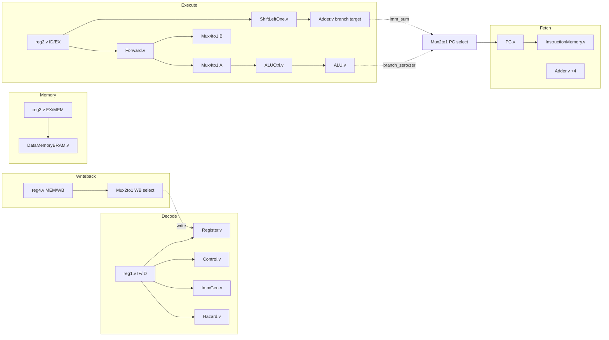

# Architecture Report — RV32I 5-Stage Pipeline

**Status**: Phase 1 audit (baseline as of this document's authoring), now updated with real findings from Phase 3 verification work. Assume correctness only where verified below; everywhere else, "assumed correct" means "not yet proven wrong," not "proven right."

## Errata (added after building the verification harness)

This audit was originally static analysis only (§0). Once a directed test
suite existed and actually ran (`sim/run_tests.sh`, 8 tests / 36 checks, all
passing as of this update), it immediately found three real bugs that
reading the RTL had not surfaced -- concrete evidence for why §15 ranked
verification as the highest-leverage next investment rather than a nice-to-have:

1. **`ALU.v`'s `sra` didn't sign-extend** -- `A`/`B` are plain (unsigned)
   ports, so Verilog's `>>>` silently degraded to a logical shift. Fixed
   with `$signed(A) >>> B`.
2. **Register-file same-cycle write/read race, gap=3** -- `Register.v` had
   no write-first bypass, and neither `Forward.v` (covers gap=1/2) nor
   `Hazard.v` (covers load-use) covered the specific case where a
   producer's WB cycle exactly coincides with a different instruction's ID
   read (concretely: producer and consumer exactly 3 instructions apart).
   See `docs/adr/0002-register-file-write-first-bypass.md`.
3. **Store data bypassed forwarding entirely** -- `reg3`'s store-data input
   was wired to the raw, unforwarded `readData2_regde` instead of the
   already-correctly-computed `readData2_final`. Any `sw` whose data
   register was written 1-2 instructions earlier stored stale data. See
   `docs/adr/0003-store-data-forwarding.md`.
4. **`slt`/`blt`/`bge`/`ble`/`bgt` compared as unsigned** -- the same root
   cause as the `sra` bug (plain, non-`signed` ALU ports), found while
   implementing `bltu`/`bgeu` and fixed in the same pass. See
   `docs/adr/0004-signed-arithmetic-casts.md`.
5. **`sll`/`srl`/`sra` used the full 32-bit shift-amount register instead of
   its low 5 bits** -- per spec, register-register shifts only use `rs2[4:0]`;
   `A >> B` with `B >= 32` discards every bit in Verilog. Invisible to every
   directed test (none happened to use a shift-amount register holding
   >=32); found by constrained-random cross-checking against an independent
   reference model. See `docs/adr/0010-random-testing-and-coverage.md`.
6. **`riscvpipeline.v` declared `funct3_regde` with a source-bit-position-
   shaped range (`[14:12]`) instead of a plain 3-bit width (`[2:0]`)** --
   every prior use connected or indexed the whole vector (position/value
   based, so the mismatched index labels never mattered), but CSR wiring's
   `funct3_regde[2]`/`funct3_regde[1:0]` bit-selects fell outside the
   declared `[12:14]` range and silently read as `x`. Found immediately by
   the CSR directed tests (a consecutive-cycle CSR read-after-write
   corrupted with X). See `docs/adr/0011-csr-and-exceptions.md`.
7. **Two real interlock bugs surfaced integrating `DataMemoryBRAM.v`'s
   synchronous read into the live pipeline**: (a) deriving the new MEM-stage
   stall from the memory's own registered "read happened" signal broke
   back-to-back loads (a busy/done-style level-vs-edge ambiguity, the same
   class of bug as errata's div/rem interlock, `docs/adr/0009`); (b) an
   initial "bubble" applied to the MEM/WB register on every stall cycle
   evicted an unrelated, already-complete instruction's forwardable result
   one cycle before an instruction stalled behind an in-flight load actually
   needed it. Neither was visible in the directed suite -- (a) needed a
   directed test with two adjacent loads, (b) only showed up via
   constrained-random cross-checking. See `docs/adr/0013-mem-stage-retiming.md`.
8. **Two more real bugs, found extending `random_gen.py` to generate CSR
   instructions**: (a) `CSR.v`'s write/trap/`mret` inputs, wired directly to
   combinational EX-stage signals, double-applied their effect whenever the
   instruction sat in `reg2` for an extra cycle behind an unrelated
   `docs/adr/0013` `mem_stall` -- the third occurrence of the "bare
   combinational level signal can't distinguish repeat from new" bug shape
   (`docs/adr/0009`, `docs/adr/0013`, now this). (b) `reg1.v`'s reset value
   for `inst_regfd` was a literal `0`, which decodes as opcode `0000000` --
   a real illegal-instruction trap since `docs/adr/0011` -- corrupting
   `mcause`/`mepc` for one cycle at every simulation's start, invisible to
   every prior test because none read those CSRs before deliberately
   triggering their own real trap first. See
   `docs/adr/0014-verification-gaps-and-csr-hold-bugs.md`.
9. **A stall could silently swallow a `jal`/`jalr` redirect**, found
   building the new alternate hazard strategy (`HazardNoForward.v`,
   `docs/adr/0016-swappable-hazard-strategy.md`): `jal`/`jalr` write a
   register *and* redirect the same cycle, so a hazard check against that
   register could assert `stall` on the exact cycle the redirect needed to
   apply -- and `PC.v` gives `stall` priority over accepting a new `pc_i`,
   silently dropping the jump. The fourth occurrence of "a new interlock
   signal needs checking against everything else sharing its consumer"
   (`docs/adr/0009`, `0013`, `0014`, now this). Found by constrained-random
   cross-checking, not any directed test.
10. **Three real bugs wiring `PROFILE_6STAGE_SPLIT_FETCH` (variable pipeline
    depth) into the live pipeline**, all found by actually running
    constrained-random programs at the new profile, none reasoned out in
    advance: (a) `reg1` (IF2/ID) stayed paired with `PC.v`'s live `pc_o`
    instead of the PC that actually fetched its instruction, corrupting
    every PC-relative computation under the split-fetch profile; (b) a
    squash-to-0 copied from `reg1.v`'s own pattern without re-deriving
    whether it applied caused a genuine infinite loop, since `reg1a`'s
    output — unlike `reg1`'s — is used as a real instruction-memory read
    address every cycle; (c) the first fix for (b), squashing to
    `redirect_target` instead, duplicated the target fetch one cycle later.
    The actual fix extends `reg1`'s own squash window by one cycle instead
    of giving `reg1a` any squash logic at all. See
    `docs/adr/0018-variable-pipeline-depth.md`.

Also implemented in this pass: `jal` (previously decoded but functionally
inert, §11) is now fully wired -- target, link value, and forwarding
correction (`docs/adr/0001-jal-implementation.md`) -- followed by the rest
of RV32I completeness: `jalr`, `lui`, `auipc`, `bltu`/`bgeu`, and
byte/halfword loads/stores (`docs/adr/0005-isa-completeness.md`). §11's ISA coverage
table and §15's readiness table are otherwise still accurate as written;
this errata doesn't change them, it documents what the errata itself
found.

## 0. Scope of this audit

Every RTL file in `design/` and the testbench (then in `simulation/`, since removed -- see §14) was read in full. No synthesis, lint, or simulation run has been performed as part of this audit — the findings below are static-analysis (read-the-RTL) findings. Section 13 explicitly separates "observed in code" from "would need simulation/synthesis to confirm."

## 1. Block diagram



This matches the diagram in [README.md](../README.md) but adds the two feedback paths that the README omits: the writeback-to-regfile path and, more importantly, the **EX-stage-to-fetch-stage branch resolution path**, which is the most architecturally significant (and riskiest) wire in the design — see §8.

## 2. Module inventory

| Module | File | Parameterized? | Role |
|---|---|---|---|
| `PIPELINED` | `riscvpipeline.v` | `INIT_FILE`, `MEM_SIZE_BYTES`, `XLEN`, `NUM_REGS`, `HAZARD_STRATEGY`, `PIPELINE_PROFILE` (`docs/adr/0012`, `0015`, `0016`, `0018`) | Top-level integration |
| `PC` | `PC.v` | `XLEN` (`docs/adr/0015`) | Program counter register, stall-holds |
| `Adder` | `Adder.v` | `XLEN` (`docs/adr/0015`) | Generic add; reused for PC+4 and branch target |
| `reg1a` | `reg1a.v` | `XLEN` (`docs/adr/0018`) | IF1/IF2 relay register, only instantiated under `PIPELINE_PROFILE=PROFILE_6STAGE_SPLIT_FETCH`; unconditional relay, no squash logic of its own (see `docs/adr/0018`'s Design for why) |
| `InstructionMemory` | `InstructionMemory.v` | `SIZE_BYTES`, `XLEN` (`docs/adr/0012`, `0015`) | Instruction ROM (default 128 bytes), `$readmemb`-loaded; reads `reg1a`'s output instead of `PC.v`'s `pc_o` under the split-fetch profile |
| `ICache` | `ICache.v` | `WAYS`, `CACHE_SIZE_BYTES`, `LINE_BYTES`, `XLEN`, `INIT_FILE`, `IMEM_SIZE_BYTES`, `MEM_LATENCY`, `REPLACEMENT_POLICY`, `VICTIM_ENTRIES` (`docs/adr/0023`, `0024`, `0041`, `0042`) | PIPT read-only I-cache, `CACHE_MODE=CACHE_WRITEBACK_SETASSOC` only (default 4-way/4KB/16B lines); privately instantiates its own `InstructionMemory.v`, no bus port needed (nothing else shares it); `MEM_LATENCY` (default 0, bit-exact) adds real per-word wait-states to its own fill engine; `REPLACEMENT_POLICY` (default 0, round-robin) selects FIFO/true-LRU; `VICTIM_ENTRIES` (default 0, disabled) instantiates a small `VictimCache.v` buffer that promotes an evicted line back in one cycle, same latency as an ordinary hit |
| `MemoryLatencyModel` | `MemoryLatencyModel.v` | `LATENCY` (`docs/adr/0024`) | Generic wait-state delay-line primitive, the `Divider.v`/`Ptw.v` start/busy/done contract reused as a pure timing element; `LATENCY=0` is a zero-cost combinational passthrough. Three independent instances when `MEM_LATENCY_I`/`MEM_LATENCY_D` are nonzero: `riscvpipeline.v`'s own D-side wrapper (around `RamWishboneAdapter`, shared by the raw LSU, `DCache.v`'s fill/writeback engine, and `Ptw.v`), `riscvpipeline.v`'s own I-side `CACHE_NONE` fetch wait, and `ICache.v`'s own internal fill-engine wait |
| `reg1` | `reg1.v` | `XLEN` (`docs/adr/0015`) | IF/ID register; also does branch-squash and stall-hold. Under `PROFILE_6STAGE_SPLIT_FETCH`, its own squash window is extended one extra cycle (`redirect_squash_extend_r`, `docs/adr/0018`) instead of `reg1a` squashing |
| `Control` | `Control.v` | No (operates on fixed instruction-encoding field widths, not XLEN — see `docs/adr/0015`) | Main decoder (opcode → control signals) |
| `ImmGen` | `ImmGen.v` | `Width` (now genuinely driven by `XLEN`, `docs/adr/0015`) | Immediate extraction |
| `Register` | `Register.v` | `XLEN`, `NUM_REGS`, `SP_INIT` (`docs/adr/0015`) | Register file (default 32×32), `x0` hardwired, `sp` reset now wired to `MEM_SIZE_BYTES` |
| `Hazard` | `Hazard.v` | `NUM_REGS` (`docs/adr/0015`), `NUM_LOOKAHEAD` (default 1, `docs/adr/0018`) | Load-use RAW hazard → stall/flush. Default strategy (`HAZARD_STRATEGY=0`, `docs/adr/0016`). `NUM_LOOKAHEAD` is infrastructure only, not exercised above its default by any shipped profile |
| `HazardNoForward` | `HazardNoForward.v` | `NUM_REGS` (`docs/adr/0015`) | Alternate strategy (`HAZARD_STRATEGY=1`, `docs/adr/0016`): stalls on every RAW hazard instead of forwarding. Deliberately not generalized alongside `Hazard.v` (`docs/adr/0018`) |
| `reg2` | `reg2.v` | `XLEN`, `NUM_REGS` (`docs/adr/0015`) | ID/EX register; also does branch-squash and load-use bubble |
| `Forward` | `Forward.v` | `NUM_REGS` (`docs/adr/0015`), `NUM_FWD_SRC` (default 2, `docs/adr/0018`) | EX/MEM & MEM/WB forwarding priority logic, generalized to a flattened farthest-producer-first bus + priority-encode loop. `NUM_FWD_SRC` is infrastructure only, not exercised above its default by any shipped profile |
| `ShiftLeftOne` | `ShiftLeftOne.v` | No | `imm << 1` for branch target |
| `Mux4to1` | `Mux4to1.v` | `size` | Lui/auipc ALU-A-operand select mux (only 3 of 4 select codes used); no longer used for forwarding, see `MuxN` |
| `MuxN` | `MuxN.v` | `size`, `NUM_SRC` (`docs/adr/0018`) | Generalized forwarding mux, replaces the two forwarding `Mux4to1` instances; `NUM_SRC` mirrors `Forward.v`'s `NUM_FWD_SRC` |
| `Mux2to1` | `Mux2to1.v` | `size` | Generic 2:1 mux, reused 3× (PC select, ALU-B select, WB select) |
| `ALUCtrl` | `ALUCtrl.v` | No (control-encoding widths, not XLEN) | ALUOp + funct3/funct7 → 5-bit ALU opcode |
| `ALU` | `ALU.v` | `XLEN` (`docs/adr/0015`) | Execute unit; also computes branch conditions |
| `reg3` | `reg3.v` | `XLEN`, `NUM_REGS` (`docs/adr/0015`) | EX/MEM register; `hold` freezes it during `mem_stall` (`docs/adr/0013`) |
| `DataMemoryBRAM` | `DataMemoryBRAM.v` | `SIZE_BYTES`, `XLEN` (`docs/adr/0012`, `0015`; access-width logic itself stays literal, see `0015`) | Data RAM, byte/halfword/word access; synchronous (registered) read |
| `DCache` | `DCache.v` | `WAYS`, `CACHE_SIZE_BYTES`, `LINE_BYTES`, `XLEN`, `REPLACEMENT_POLICY`, `VICTIM_ENTRIES`, `BURST_ENABLE` (`docs/adr/0023`, `0041`, `0042`, `0043`) | PIPT write-back + write-allocate D-cache, `CACHE_MODE=CACHE_WRITEBACK_SETASSOC` only (default 4-way/4KB/16B lines); Wishbone-master-shaped fill/writeback engine shared between capacity eviction and `fence`'s `flush_all` (arbitrated by `MemoryController.v`, `docs/adr/0043`); `REPLACEMENT_POLICY` (default 0, round-robin) selects FIFO/true-LRU; `VICTIM_ENTRIES` (default 0, disabled) instantiates a small `VictimCache.v` buffer, chaining its own dirty-eviction writeback through the existing `S_WB` state when it overflows; `BURST_ENABLE` (default 0, disabled) drives real Wishbone B3 CTI burst signaling per beat instead of always `CTI_CLASSIC` |
| `reg4` | `reg4.v` | `XLEN`, `NUM_REGS` (`docs/adr/0015`) | MEM/WB register; `hold` freezes it during `mem_stall` (`docs/adr/0013`) |
| `CSR` | `CSR.v` | `XLEN` (`docs/adr/0015`; `csr_addr` stays a fixed 12 bits) | Machine-mode CSR file, trap/`mret` entry-exit, plus `mcycle`/`minstret`/`mcountinhibit`/9 generic `mhpmcounter`/`mhpmevent` performance counters (`docs/adr/0025`) — `mhpmevent` widened to 5 bits for 9 more per-cause stall-breakdown events (`docs/adr/0026`); formally proven (`docs/adr/0027`) trap-entry/exit privilege swap, plus formal-observability output ports (`mstatus_mpie`/`_sie`/`_spie`/`_spp`/`_mpp`) |
| `Divider` | `Divider.v` | `XLEN` (`docs/adr/0015`) | Multi-cycle restoring divider for `div`/`divu`/`rem`/`remu` |

`XLEN`/`NUM_REGS` are named parameters, not truly variable at other values — RV32I's own instruction encoding fixes a 32-bit instruction word and 5-bit rs1/rs2/rd fields regardless of what they're set to (see `docs/adr/0015`'s Design section for exactly which fields did and didn't get parameterized, and why).

**Reuse is already present** (`Adder` used twice, `Mux2to1` used three times) — this is a good foundation for the "reusable IP" objective, but the reuse stops at trivial combinational primitives. None of the stage-specific logic (`Control`, `ALUCtrl`, `Hazard`, `Forward`) is written against a shared types/constants package, so there is no single source of truth for opcode values, ALUCtl encodings, or pipeline register field layouts. Every module re-derives bit widths and magic numbers independently.

## 3. Pipeline register contents (the actual "architecture" of this CPU)

### `reg1` (IF/ID)
| Field | Width | Purpose |
|---|---|---|
| `inst_regfd` | 32 | Fetched instruction |
| `pc_o_regfd` | 32 | PC of fetched instruction |

Squash behavior: on `branch_regde & zero` → loads `0x00000013` (`nop`) and `pc=0`. On `stall` → holds. This is the correct location for a load-use stall bubble (freeze IF/ID, freeze PC) but it double-encodes reset (`~rst`) and branch-squash as separate `if` arms with duplicated field lists — see §12.

### `reg2` (ID/EX)
Carries every decoded control signal (`branch`, `memRead`, `memtoReg`, `memWrite`, `ALUSrc`, `regWrite`, `ALUOp`), the destination register, both register-file read values, the immediate, funct3/funct7, and the two raw source-register numbers (needed downstream only for forwarding compare in `Forward.v`, since the actual operand values are forwarded via mux rather than at this register). This is the widest and busiest of the four pipeline registers — a natural target if `PIPELINED` is ever split into a `struct`/`packed` bus (see Roadmap R-2).

### `reg3` (EX/MEM)
Carries `ALUOut`, `readData2` (store data), destination register, and the memory/writeback control bits. Notably carries `zero`/`branch_regde`/`imm_sum` through to EX/MEM even though branch resolution has *already happened* by the time this register latches (branch resolution reads `reg2`'s outputs directly, combinationally, in the same cycle) — these three fields (`branch_regem`, `zero_regem`, `imm_sum_regem`) are dead: nothing downstream reads them. **Confirmed by grep**: no consumer of `branch_regem`, `zero_regem`, or `imm_sum_regem` exists anywhere in `riscvpipeline.v`. This is unused pipeline-register width — free to remove, and a good first PR for a new contributor.

### `reg4` (MEM/WB)
Carries `readData` (load result), `ALUOut_regem` (ALU result), destination register, `memtoReg`, `regWrite`. Minimal and clean — this is the tightest of the four registers.

## 4. Control unit (`Control.v`)

Pure combinational decoder keyed on `opcode` only (7 bits), producing `{branch, memRead, memtoReg, ALUOp[1:0], memWrite, ALUSrc, regWrite}`. `funct3`/`funct7` are *passed through* unmodified (not used for control decisions in this module) — all funct-based sub-decoding happens later in `ALUCtrl`. This is architecturally correct (matches Patterson & Hennessy's canonical single-cycle/pipelined control unit split) and is one of the cleanest modules in the repo.

Opcodes handled: `0101010` (custom), `0000011` (load), `0100011` (store), `0010011` (I-type ALU), `0110011` (R-type ALU), `1100011` (branch), `1101111` (JAL, decoded but see §11 — datapath doesn't actually support it correctly). Everything else falls into an explicit all-zero `default` — this module is fully specified and latch-free.

## 5. ALU / ALUCtrl encoding

`ALUCtrl.v` builds a 5- or 6-bit concatenation of `{ALUOp, funct7, funct3}` (R-type/I-type-shift) or `{ALUOp, funct3}` (branches, most I-type) and maps it to a 5-bit `ALUCtl`. Full opcode table:

| ALUCtl | Operation | ALUCtl | Operation |
|---|---|---|---|
| `00000` | add | `01001` | and |
| `00001` | sub | `01010` | beq |
| `00010` | sll | `01011` | bne |
| `00011` | slt | `01100` | blt |
| `00100` | sltu | `01101` | bge |
| `00101` | xor | `01110` | ble* |
| `00110` | srl | `01111` | bgt* |
| `00111` | sra | `10101` | ctz (custom) |
| `01000` | or | `11111` | illegal/default |

`*` `ble`/`bgt` are **not standard RV32I** — real RISC-V only defines `beq/bne/blt/bge/bltu/bgeu` (6 funct3 values). This design instead maps funct3 `100`/`101` to `ble`/`bgt`, meaning it diverges from the real RV32I branch encoding. This should be flagged clearly as a **custom ISA extension**, not standard RV32I, in any external-facing documentation — someone assembling with a real RISC-V toolchain (`riscv32-unknown-elf-as`) would get `bltu`/`bgeu` semantics on those same bit patterns, not `ble`/`bgt`. This is the single biggest "is this really RV32I" claim to correct.

`ALU.v` computes `branch_zero` for every branch variant and unconditionally does `ALUOut = A & B` on all six branch paths — `ALUOut` is architecturally meaningless for branches (never consumed downstream since `regWrite=0` on branches), but the redundant `A & B` costs real gates/power in a real synthesis. Free cleanup.

The custom `ctz` op (`10101`) is a **32-cycle unrolled loop in a combinational `always @*` block** (`for (i=0;i<XLEN;...)`). Functionally fine in simulation; in synthesis this becomes a 32-deep priority-encoder chain — almost certainly the **longest combinational path in the entire ALU**, and thus a strong candidate for the processor's critical path if this opcode is reachable (see §8). Its opcode (`OPCODE_CUSTOM`, `0001011`) also has a real, separate history worth knowing: it used to be `0101010` (bits `[1:0]`=`10`), which silently collided with the RVC compressed-instruction-length check added later (`inst[1:0]!=2'b11` marks a 2-byte compressed instruction) — every `ctz` execution was corrupted from the moment RVC support landed until `docs/adr/0041` found and fixed it, reassigning the opcode to RISC-V's own spec-reserved `custom-0` slot. The loop bound itself also had a genuine, narrower off-by-one (`i<XLEN-1`, missing bit `XLEN-1` — only ever mattered for `A==0`, since any input with a set bit reaches the correct count before that bit would be examined), fixed in the same phase.

## 6. Hazard detection (`Hazard.v`)

```verilog
flush = memRead_regde && ((write_to_Reg_regde == readReg1_fd) || (write_to_Reg_regde == readReg2_fd))
stall = flush
```

This is the textbook load-use hazard: if the instruction currently in ID/EX (`reg2`) is a load, and the instruction currently in IF/ID (`reg1`) reads the load's destination register, stall the PC and IF/ID, and bubble ID/EX for one cycle. Correct in concept. Two gaps:

1. **No `x0` exclusion.** If `write_to_Reg_regde == 0` (e.g., `lw x0, 0(x1)` — legal, discards the load), the hazard unit still stalls, even though `x0` reads always return 0 regardless of forwarding. Wasted cycle, not a correctness bug (`Register.v` already forces `x0` reads to 0 combinationally), but worth fixing when touching this file.
2. **No hazard check against `reg3`/`reg4`.** This is fine *only* because `Forward.v` covers EX/MEM and MEM/WB RAW hazards for register-value forwarding — the load-use case specifically needs a stall (not forward) because the loaded value isn't available until the end of MEM, one cycle later than a normal ALU result. The division of labor between `Hazard.v` (load-use, 1-cycle-late data) and `Forward.v` (everything else, data available in time) is architecturally correct and matches the standard MIPS/RISC-V textbook pipeline design.

## 7. Forwarding (`Forward.v`)

Priority-encoded per operand: EX/MEM (`regWrite_regem`, most recent) beats MEM/WB (`regWrite_regwb`), both gated on `dest != x0`. This is correct RAW-hazard priority (forward the *freshest* value). `forwardA`/`forwardB` are 2-bit but the `Mux4to1` consumers only implement 3 of 4 select codes (`00`=regfile, `01`=MEM/WB, `10`=EX/MEM); `2'b11` is unreachable given `Forward.v`'s logic (it never emits `11`), so the mux's fallback-to-`s0` default for `11` is dead code, not a live bug — but it's a code smell: a 2-bit signal with a value that can never occur should either be a proper 3-way tagged encoding with an explicit "invalid" assertion, or narrowed. Good candidate for a `unique case` + assertion once a lint/formal flow exists (Roadmap V-3).

## 8. Branch resolution — the architecturally load-bearing decision

Branches resolve in **EX**, one stage later than the classic "resolve in ID with a dedicated comparator" scheme, and two stages after fetch. The resolution signal (`branch_regde & zero`, both driven off `reg2`'s *registered* outputs and the *combinational* `ALU.zero` output) feeds directly, combinationally, into the **fetch-stage PC select mux** (`m_Mux_PC`). This means:

- **Squash condition is `branch_regde & zero` in both `reg1` and `reg2`** — i.e. squashing (and therefore the fetch penalty) fires only when a branch is resolved **taken**. Not-taken branches fall through with zero penalty, since sequential fetch was already the (correct) guess. This is textbook predict-not-taken behavior: **misprediction penalty = 2 cycles, paid only on taken branches.** This reading should still get a directed testbench case (Roadmap V-2) before being relied on, since it's a static-analysis conclusion, not a simulated one.
- **The combinational path this creates is long**: `reg2`'s registered branch/funct fields → `ALUCtrl` → `ALU` (comparator) → `zero` → AND with `branch_regde` → `Mux2to1` PC select → `PC` register input — all settling within one clock period, in the same cycle the ALU is also computing `A & B` for the branch's (unused) `ALUOut`. **This is very likely the critical path of the whole processor** and should be the first thing measured once a synthesis flow exists (Roadmap F-1).

## 9. Memory interfaces (updated — see errata items 5-7 and `docs/adr/0005`, `0011`, `0012`, `0013`)

**Instruction memory**: size is now a `parameter` (`SIZE_BYTES`, default 128, threaded from `PIPELINED`'s `MEM_SIZE_BYTES`, `docs/adr/0012`), word-read only; `readAddr >= SIZE_BYTES` still returns 0. Past-end-of-program execution is no longer a silent, harmless NOP stream, though — as of `docs/adr/0011`, opcode `0000000` is not a valid instruction and correctly raises an illegal-instruction trap. Every test program (directed and random-generated) now ends in a deliberate `jal x0, self` spin loop rather than relying on running off the end into zero-filled memory; "program ended" is still not something architectural state exposes directly (there's no `wfi`/halt instruction), but the spin-loop convention makes intent explicit rather than accidental.

**Data memory**: size is likewise now a `parameter` (`docs/adr/0012`). Byte/halfword access width (`lb`/`lh`/`lbu`/`lhu`/`sb`/`sh`) was completed in `docs/adr/0005` — this section's original claim that only `lw`/`sw` worked is no longer accurate; see §11's ISA coverage table for current state.

As of `docs/adr/0013`, the live data memory is `DataMemoryBRAM.v` (synchronous write **and** read) — `docs/adr/0012` built and unit-tested this as a standalone, BRAM-inferable replacement for the old combinational-read `DataMemory.v` (since removed, fully superseded) but deliberately deferred wiring it in, since doing so changes when load data becomes available (one cycle later than before). That retiming is now done: `riscvpipeline.v`'s `mem_stall` interlock holds `reg2`/`reg3`/`reg4` for exactly the one extra cycle a fresh load spends in `reg3`, mirroring the shape `docs/adr/0009`'s divider interlock established one stage earlier in the pipe. No changes were needed to `Hazard.v` or `Forward.v` themselves — the existing load-use stall/bubble and MEM/WB forwarding path turned out to already be sufficient once `reg2`/`reg3`/`reg4` correctly held their occupants for the extra cycle (see the ADR for the two real interlock bugs found getting this right).

## 10. Reset strategy

Every clocked module uses `if (~rst) <reset values> else <normal operation>`, checked *inside* the `always @(posedge clk)` block — this is a **synchronous, active-low reset**, which is synthesis-friendly and ASIC-conventional. Good.

However: the signal is called `rst` throughout the design but is literally wired to the top-level port named **`start`**, and the testbench treats it as "hold low to reset, then drive high to run" (`start = 0; #10 start = 1;`) — i.e., it is *never deasserted again* after the initial reset. There is no reset synchronizer (not needed for synchronous reset). ~~Recommend renaming the port~~ **Done, partially**: the port itself was left as `start` (renaming it would mean touching every instantiation across `sim/tb/*.v`, `fpga/top.v`, and this document for a cosmetic gain), but `riscvpipeline.v` now carries an explicit header comment documenting the misnomer and its single-cycle-CPU-template origin, so the behavior is no longer undocumented even though the name itself wasn't changed. (This section originally cited a stale in-code comment, `// TODO: connect wire to realize SingleCycleCPU`, as evidence of that origin — that comment has since been removed from the file; the origin is now documented in prose instead of left as an accidental artifact.)

## 11. ISA coverage matrix (RV32I base, 47 instructions)

**Updated by `docs/adr/0001` and `docs/adr/0005`** — this section originally documented real gaps (jal inert, jalr/lui/auipc absent, bltu/bgeu absent, byte/halfword access absent); all have since been closed and verified (`sim/run_tests.sh`, 12 tests / 50 checks). Table below reflects current state; see those ADRs for what changed and why.

| Category | Implemented | Missing |
|---|---|---|
| R-type ALU | `add sub sll slt sltu xor srl sra or and` (10/10) | — |
| I-type ALU | `addi slti sltiu xori srli srai ori andi` (8/8, via `ALUOp=11`) | — |
| Loads | `lw lb lh lbu lhu` (5/5, funct3-selected width in `DataMemoryBRAM.v`) | — |
| Stores | `sw sb sh` (3/3) | — |
| Branches | `beq bne blt bge bltu bgeu` (6/6 standard, all at real spec funct3 positions) plus custom `ble bgt` (funct3=010/011, the two funct3 codes real RV32I spec reserves and leaves undefined; moved here from the real `blt`/`bge` spec positions by `docs/adr/0030-branch-encoding-fix.md` — see that ADR and `docs/adr/0005` for the historical positions) | — |
| Jumps | `jal jalr` (both fully wired: target, PC+4 link, forwarding correction) | — |
| Upper-immediate | `lui auipc` (both reuse the ALU's `ADD` via an A-operand override, no new writeback path) | — |
| Custom | `ctz`-like instruction, opcode `0001011` (RISC-V's own spec-reserved `custom-0` slot, `docs/adr/0041`), `ALUOp=10`, funct7=`1`/funct3=`111` pattern | — |
| Fence/system | `ecall ebreak mret` (M-mode synchronous exceptions), `csrrw csrrs csrrc csrrwi csrrsi csrrci` against `mstatus mie mtvec mscratch mepc mcause mip` (`docs/adr/0011-csr-and-exceptions.md`), and real asynchronous machine-timer/machine-external interrupts with hardware sources (`design/Timer.v`, `design/Uart.v`) behind them — see `docs/adr/0020-soc-integration.md`. `fence` has real semantics under `CACHE_MODE=1` (`docs/adr/0023-caches.md`): flushes every dirty D$ line to memory, occupying MEM via the same generalized `mem_stall` interlock a D$ miss uses — a genuine no-op only when `CACHE_MODE=0` (`CACHE_NONE`, the default), where there's still nothing to flush | `fence.i`; PMP |

**Bottom line**: RV32I base ISA plus RV32M (`docs/adr/0006`) is complete. M-mode synchronous exceptions and the CSRs needed to handle/return from them (`docs/adr/0011`) closed the last ISA-completeness gap named in Phase 5; real asynchronous interrupts (`docs/adr/0020`) were added later, once Phase D gave this core an actual hardware interrupt source (a timer and a UART RX-ready line) to drive them with. Only `fence` (structurally a no-op here) remains unimplemented, by design rather than oversight. The README's claim of "all the R I L S B type instructions" is now accurate and understates what's actually implemented.

## 12. Coding style / synthesis-friendliness observations

- ~~No `` `default_nettype none`` in any file~~ **Done** (`docs/adr/0008`): every `design/*.v` file now brackets itself with `` `default_nettype none``/`` `default_nettype wire``, which caught 3 genuinely undeclared wires in the process.
- ~~No shared constants/parameters package~~ **Done**: `design/riscv_defs.vh` centralizes opcodes/ALUOp/ALUCtl encodings, migrated into `Control.v`/`ALUCtrl.v`/`ALU.v` (`ImmGen.v` left as literals — already clearly commented per-case, migrating it was judged not worth the churn). `sim/tools/asm.py` still keeps an independent Python copy of the same encodings (can't `` `include`` a Verilog header) — noted as a known sync-by-hand gap in `docs/ROADMAP.md`.
- ~~`wire [14:12] funct3_regde;` in `riscvpipeline.v`~~ **Fixed** (`docs/adr/0011`): this was flagged here as merely cosmetic, but turned out to be a real latent bug — every use up to that point connected/indexed the *whole* vector (position/value based, so the mismatched index labels never mattered), but `docs/adr/0011`'s CSR wiring was the first code to bit-select *into* it (`funct3_regde[2]`, `funct3_regde[1:0]`), and those indices fall outside the declared `[12:14]` range, silently reading as `x`. Now `[2:0]`. Worth remembering as a general lesson: an index-range mismatch that only ever appears in whole-vector connections is invisible until something finally slices it.
- `ImmGen.v`'s `case` statement has no `default` arm — for any opcode not in {`0010011`,`1100011`,`0000011`,`0100011`,`1101111`}, `imm` is left unassigned in that evaluation of the `always @*` block, which in a real synthesis tool infers a **level-sensitive latch**, not a wire. Not a functional bug today (every consumer of `imm` gates it behind `ALUSrc`, which is 0 for opcodes ImmGen doesn't cover), but it will show up as a "latch inferred" warning the moment anyone runs a real lint pass, and is exactly the kind of thing Phase 3 (verification) should catch with an assertion or lint gate before it's allowed to merge again.
- ~~`reg1.v`/`reg2.v` repeat their entire reset-value field list~~ **Done** (`docs/adr/0008`): `reg2.v` now uses text macros (`` `ZERO_CONTROL_FIELDS`` etc.) instead of repeating ~90 lines across 4 arms; `reg1.v` needed no change (already minimal).
- ~~Every register file, memory, and pipeline register in the design is sized as literal `32`/`128`/`5` rather than a `localparam`~~ **Done** (`docs/adr/0012`, `docs/adr/0015`; genuinely variable as of `docs/adr/0028`, Generation 2 Phase M): `DataMemory.v`/`InstructionMemory.v` sizes are a `parameter` (`SIZE_BYTES`), threaded from `PIPELINED`'s `MEM_SIZE_BYTES` (`docs/adr/0012`). The architectural register file and every pipeline register's data/register-address widths are now `XLEN`/`NUM_REGS` parameters too (`docs/adr/0015`). `docs/adr/0015` itself called this "named, not truly variable" (RV32I's own 32-bit instruction word is independent of XLEN's value) — `docs/adr/0028` is where that promise actually got exercised: `XLEN=64` is a real, fully-verified configuration (existing RV32IMAF instruction set bit-correct, plus the new RV64-only `*w`/`ld`/`sd`/`lwu` instruction family), not just a parameter that compiles at other values. The MMU stays Sv32-only (force-disabled at XLEN=64, a real, deliberate scope limit, not an oversight); Generation 3's own Phase O (`docs/adr/0031`) did the first real RV64 CSR/privilege layout work — `mstatus.UXL/SXL` (fixed-2 read-mux constants) and `satp`'s MODE/ASID/PPN decode (genuinely XLEN-conditional between Sv32 and Sv39 layouts, `translate_enable` itself still untouched) — with the actual Sv39 MMU/TLB/page-table-walker (a new design, not a port of the existing Sv32 `Tlb.v`/`Ptw.v`) still Phase P's own task.

## 13. What this audit could *not* determine from static reading alone

These require an actual simulation or synthesis run and are listed here specifically so Phase 3 (verification) has a concrete initial test list:

1. Whether the pipeline actually produces correct architectural results end-to-end for a nontrivial program (no self-checking testbench exists today — see §14).
2. ~~The `ctz` off-by-one on `A[31]`~~ — resolved, `docs/adr/0041` (§5's own note has the full story, including the real opcode/RVC-collision bug this originally-flagged off-by-one turned out to mask).
3. Actual critical-path length/Fmax (§8) — needs synthesis (even an open-source Yosys+nextpnr flow would do for a first estimate).
4. Whether `InstructionMemory`'s `$readmemb` path (`C:/Users/samar/Downloads/TEST_INSTRUCTIONS.dat`, hardcoded, machine-specific) even allows the existing testbench to run in this environment — almost certainly not, since that path doesn't exist here. **This blocks all other verification work until fixed or parameterized.**

## 14. Testbench assessment (historical — `simulation/` since removed)

`simulation/riscvpipeline_tb.v` was, at the time of this original audit, a **waveform-dump-and-inspect** testbench: it drove reset, poked `sp` directly into the register file array (a simulation-only backdoor, fine for bring-up, not representative of real boot), ran for a fixed 3000-time-unit window, and dumped a VCD. There were no assertions, no expected-result checks, no pass/fail output, no coverage collection, and (per point 13.4) it couldn't even load a program on a machine other than its original author's.

That was the correct **starting point** for Phase 3, not a criticism of what existed — a waveform-dump testbench is a completely normal first artifact for a student pipeline project. It has since been entirely superseded by the `sim/` self-checking harness this audit's own findings motivated (`sim/run_tests.sh`, directed programs, assertions, random cross-checking, coverage — see §15's Phase 3 row), and the `simulation/` directory (which had become dead weight: unreferenced by any tooling, containing a stray empty file alongside the one testbench) was removed once that superseding work was complete rather than kept around as an unused historical artifact.

## 15. Readiness vs. the ten requested phases

| Phase | Current readiness |
|---|---|
| 1. Audit | This document. Done. |
| 2. Code quality | Latch risk, hardcoded instruction-memory path, defs package, `default_nettype none` (which found 3 genuinely undeclared wires, `docs/adr/0008`), dead-field removal, and `reg1`/`reg2` dedup are all done. Real Verible lint config (CQ-5) is the only item still open. |
| 3. Verification | Substantially complete. Self-checking directed suite (`sim/run_tests.sh`, 25 programs / 136 checks, including 6 CSR/exception tests and 2 standalone unit tests), 4 embedded assertions (`docs/adr/0007`), an independent reference-model ISS (`sim/tools/iss.py`, covering CSR/`ecall`/`ebreak`/`mret`) cross-checked against constrained-random programs including CSR ops (`docs/adr/0010`, `docs/adr/0014`), and functional coverage (`sim/tools/coverage_report.py`, confirms every branch direction and `ALUCTL_ILLEGAL` are now exercised). Found and fixed 10 real bugs total (see errata above). Remaining gap: `random_gen.py` still doesn't generate `ecall`/`ebreak`/`mret`/illegal-instruction control flow (deliberately scoped out, see `docs/adr/0014`). **Formal verification** (`docs/adr/0027`, Phase L) added a first BMC layer on top of simulation: 5 unbounded (k-induction) proofs (`Register`/`Forward`/`Hazard`/`HazardNoForward`/a `CSR` trap-entry-exit subset) via Yosys+SymbiYosys (`sim/formal/*.sby`); a 6th whole-pipeline property was attempted but hit a real, undetermined Yosys logic-loop finding, documented rather than forced through. |
| 4. Visualization | First version done: `sim/tb/gen_trace.v` + `sim/tools/gen_trace.py`/`build_viewer.py` produce an interactive, playable pipeline-occupancy viewer from a real execution trace (`make viewer`). Multi-program comparison and VCD export still open. |
| 5. Extensions (RV32M/CSR/F/SoC/caches/prediction/MMU/etc.) | RV32I completeness (5.1, `docs/adr/0005`), RV32M (5.2, `docs/adr/0006` + `0009`), CSR/M-mode synchronous exceptions (5.3, `docs/adr/0011`), RV32F single-precision floating point (`docs/adr/0019`), SoC integration — a real Wishbone-style bus, UART, timer, and real asynchronous machine-timer/machine-external interrupts (`docs/adr/0020`) — branch prediction — a BHT+BTB predictor, swappable via `BRANCH_PREDICTOR` (`docs/adr/0021`) — and a full Sv32 MMU — M/S/U privilege modes, 2-level page tables, a unified TLB, a page-table walker, real page faults with privilege-aware trap delegation (`docs/adr/0022`) — all done. RV32M includes a real multi-cycle divider (`design/Divider.v`) with a genuine pipeline interlock — the project's first multi-cycle-execute mechanism, whose stall/redirect shape CSR/exceptions, the interrupt redirect path, branch misprediction recovery, and the MMU's own page-table-walker interlock all reused directly. Caches/dual-issue remain not started; dual-issue dropped from near-term scope per the Generation 1 scope decision (`docs/ROADMAP_VISION.md`), caches (Phase G) next. |
| 6. Research platform (pluggable subsystems) | Parameterization prerequisite done: memory sizes (`docs/adr/0012`), register file/pipeline register widths (`XLEN`/`NUM_REGS`, `docs/adr/0015`). "Compare hazard strategies" done (`docs/adr/0016`): a swappable `HazardNoForward.v` alternate (stall-only, no forwarding), selected via `HAZARD_STRATEGY` at elaboration time, verified against 450+ random programs plus every hazard-pattern directed test, benchmarked at 30-43% more cycles than the default forwarding strategy. "Compare pipeline depths" done (`docs/adr/0018`): a `PIPELINE_PROFILE` parameter (`PROFILE_5STAGE` default, `PROFILE_6STAGE_SPLIT_FETCH` alternate), benchmarked at 9-14% more cycles than the default. "Compare branch predictors" done (`docs/adr/0021`): a `BRANCH_PREDICTOR` parameter (`PREDICTOR_STATIC` default, `PREDICTOR_DYNAMIC_BHT_BTB` alternate), benchmarked at 11-24% fewer cycles than the default. Splitting EX/MEM (branch-resolve-early, cache-miss stalls) remains explicitly not attempted — a genuinely larger redesign, deliberately scoped out rather than dropped silently. |
| 7. FPGA support | Memory sizes parameterized, a `debug_x10` observability port, a vendor-neutral bring-up top level (`fpga/top.v`), and a generic XDC constraints template (`docs/adr/0012`). `design/DataMemoryBRAM.v` (synchronous read) is now wired into the live pipeline (`docs/adr/0013`), replacing the old combinational-read `DataMemory.v` (deleted). The one remaining item is real hardware validation -- nothing has touched an actual board yet. |
| 8. Tooling | `sim/tools/asm.py` (assembler, now with CSR/`ecall`/`ebreak`/`mret` encoding and a raw `word` directive), `sim/tb/trace_debug.v` (ad hoc cycle trace), and now `sim/tools/debugger.py` (interactive ISS-based step debugger — `step`/`continue`/`break`/`regs`/`mem`/`csr`/`disas`, `make debug PROGRAM=...`) plus a shared `sim/tools/disasm.py` extracted for it (also fixed a real RV32M/CSR misdisassembly bug in the pipeline viewer). A benchmark runner (`sim/tools/bench_runner.py`) and a performance profiler (`sim/tools/profiler.py`, `docs/adr/0026`, real `csrrs`-based IPC/CPI/stall-breakdown/instruction-mix reports) are both done. |
| 9. Documentation | This document, `docs/ROADMAP.md`, and 15 ADRs (`docs/adr/`) as of this update — grown incrementally alongside each phase rather than as a standalone effort, per this phase's own guidance. |
| 10. Benchmarking | No real CoreMark/Dhrystone (no RISC-V C toolchain available in this environment, checked directly). Three hand-written microbenchmark kernels in this core's own assembly (`sim/benchmarks/bench_*.s`) plus a cycle-count/IPC runner (`sim/tools/bench_runner.py`, `make benchmark`) exist instead — real RTL cycle counts, correctness-cross-checked against the ISS, useful for relative comparison against future changes to this core, not for comparing against other cores' published scores. |

Git repository initialized and committed as of this update (see commit history).
